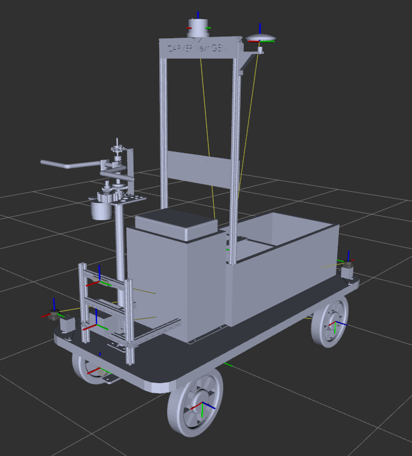
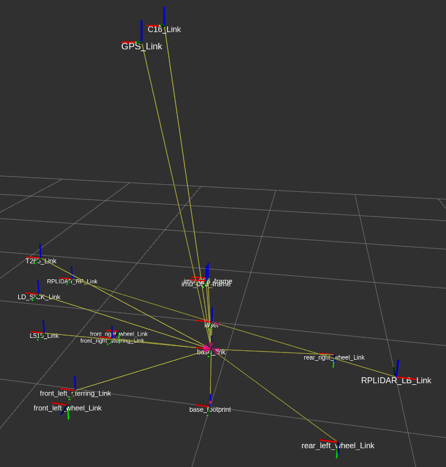
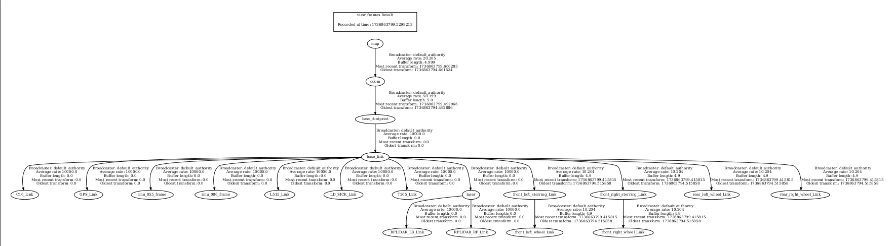

# Autonomous ackerman steering mobile robot

**This is Autonomous ackerman steering mobile robot class project in FRA501(Robotics Development) at *FIBO*.**

<p align="center"></p>

<details>
  <summary>Table of Contents</summary>
  <ol>
    <li>
      <a href="#about-the-project">About The Project</a>
        <ul>
            <li><a href="#system-architecture">System architecture</a></li>
        </ul>
    </li>
    <li>
      <a href="#components-of-the-robot">Components of the Robot</a>
    </li>
    <li><a href="#prerequisites">Prerequisites</a></li>
        <ul>
            <li><a href="#ros2-setup-environment">ROS2 setup environment</a></li>
            <li><a href="#intallation">Intallation</a></li>
        </ul>
    </li>
    <li><a href="#usage">Usage</a></li>
    <ul>
        <li><a href="#launch-the-project">Launch the project</a></li>
        <li><a href="#service-call-in-this-project">Service call in this project</a></li>
        <li><a href="#teleop_twist_keyboard">Teleop twist keyboard</a></li>
    </ul>
    <li><a href="#features">Features</a></li>
    <li><a href="#contact">Contact</a></li>
  </ol>
</details>

## About The Project

This project involves the development of an autonomous Ackermann steering mobile robot. The robot can navigate to a target location independently. It is equipped with a LiDAR sensor, along with an IMU and GPS, enabling it to determine its position on the previously mapped environment.

### System architecture

<p align="center"></p>

You can read full system architecture via this link -> [Full system architecture](https://miro.com/app/board/uXjVLuVrW2E=/?moveToWidget=3458764613100769122&cot=14)

## Components of the Robot

In this section show what sensors, actuators, microcontrollers or etc. we use in this project. And you can click the link that embeded on components name to see what they use for or how it's work.

### 1. Laser and Sensor

- [2D RPLIDAR C1 Laser](https://github.com/CARVER-NEXT-GEN/RPLiDAR-C1-2D-LiDAR) (GIT)
- [3D RPLIDAR C16](https://github.com/CARVER-NEXT-GEN/LSLiDAR-C16-3D-LiDAR) (GIT)
- [LD-MRS400001](https://github.com/CARVER-NEXT-GEN/SICK-LD-MRS400001-3D-LiDAR) (GIT)
- [Realsense L515](https://github.com/CARVER-NEXT-GEN/Intel-RealSense) (GIT)

### 2. IMU

- [BNO055](https://www.adafruit.com/product/2472)
- [BNO086](https://docs.sparkfun.com/SparkFun_VR_IMU_Breakout_BNO086_QWIIC/introduction/)

### 3. GPS

- [SparkFun GPS-RTK Dead Reckoning Kit](https://github.com/CARVER-NEXT-GEN/SparkFun-VR-IMU-Breakout-BNO086-Qwiic-SPI) (GIT)
- [GNSS Multi-Band L1/L2 Surveying Antenna](https://github.com/CARVER-NEXT-GEN/carver_gps) (GIT)

### 4. Microcontroller

- [STM32G474RE](https://www.st.com/en/microcontrollers-microprocessors/stm32g474re.html)
- [ESP32 S3 Pico](https://www.waveshare.com/wiki/ESP32-S3-Pico)

### 5. Motor

- [1000 W 48 V Brushless Hub Motor](https://evgracias.com/product-view/tsuyo-bldc-brushless-hub-motor1000-w-48-v) 
- [MY1016Z-250W24V](https://www.amazon.com/MY1016Z-Electric-Brushed-Wheelchair-Joystick/dp/B08PVFSSJK)

### 6. Motor Driver

- [MD20A-cytron 20Amp 6V-30V](https://th.aliexpress.com/item/1005006861348837.html)

### 7. Encoder

- [AMT21EV](https://github.com/CARVER-NEXT-GEN/AMT212E-V) (GIT)

## Prerequisites

In this section show what you need to install before using this project.

⚠️**Warning:** Make sure your OS is `Ubuntu 22.04` and you already install `ROS2 Humble` on your computer. If you're not install Ubuntu 22.04 and ROS2 Humble you can follow the [Ubuntu 22.04.5 LTS (Jammy Jellyfish)](https://releases.ubuntu.com/jammy/) and [Official ROS2 documentation](https://docs.ros.org/en/humble/index.html) to install. Additionally, this project require basic Ubuntu knowledge and intermediate ROS2 knowledge.

### ROS2 setup environment

Follow the [Official ROS 2 tutorial](https://docs.ros.org/en/humble/Tutorials/Beginner-Client-Libraries/Colcon-Tutorial.html) to create your Colcon workspace.

```bash
mkdir ~/your_workspace
cd ~/your_workspace
colcon build
source install/setup.bash
```
To automate workspace setup every time you open a new terminal, add the following line to your `~/.bashrc` or `~/.bash_profile` file:

```bash
echo "source ~/your_workspace/install/setup.bash" >> ~/.bashrc
source ~/.bashrc
```

### Intallation

⚠️**Warning:** Before using this project you need to follow all the components section that have `(GIT)` behide the name of component to setup the components. (<a href="#components-of-the-robot">back to Components</a>)

To installation this project

```bash
cd ~/your_workspace
git clone https://github.com/CARVER-NEXT-GEN/CARVER_WS.git
```

## Usage

In this section show how to use this project.

- Launch the carver_ws to started robot.

  ```bash
  ros2 launch ???
  ```

After launch carver_ws you can switch mode at Carver Interface(HMI) to select and control robot.

## Features

### Carver Interface

<p align="center"></p>

The Carver system features a robust Human-Machine Interface (HMI) to provide intuitive control and operational flexibility. Users can select various modes and interact with the system effectively:

1. **Mode Selection**
   - Modes available:
     - **Steering Mode:**
       - Allows users to control the steering manually using their hands.
       - Users can twist the hand accelerator to move Carver faster and apply the brake to slow it down.
       - Provides two buttons: *Forward* and *Backward* for switching between forward gear and reverse gear.
     - **Teleoperation (Teleop) Mode:**
       - Enables users to control the steering via Carver's website.
       - Users can control the steering motor to turn left or right and adjust the speed using the BL motor.
       - Offers the same functionality as manual control but remotely through the web interface.
     - **Joystick Mode:**
       - Allows control using a remote control device.
       - Users can control the steering motor for turning and adjust the speed via the BL motor.
       - Provides functionality identical to manual control but operated through the joystick.
     - **Auto Mode:**
       - Enables autonomous driving.
       - Users can specify a destination on a map, and Carver will automatically navigate to the specified point.

2. **Accelerator and Brake Control**
   - Hand Accelerator:
     - Enables Carver to move faster when twisted by hand.
   - Steering Brake:
     - Allows users to slow down Carver as needed.

3. **State Monitoring**
   - Reads and monitors the state of:
     - Emergency
     - Brake
     - Accelerator

4. **Lighting Control**
   - Supports controlling the following lights on Carver:
     - **Front Light**
     - **Back Light**
     - **Turn Signal Lights**
     - **Parking Lights**

### Visualization

#### 1. Carver description

You can use the [Carver_Description_package](https://github.com/CARVER-NEXT-GEN/carver_description) to visualize the robot in rviz2. It requires the MESH and URDF files of the robot, with the correct coordinate frame of the IMU sensor and base link.

1. rviz2 window after use Carver_Description_package

  

2. Transformation of robot with robot description

<p align="center"></p>

3. Only transformation of robot

<p align="center"></p>

#### 2. View Transformations Execute the following command to watch the relationships between the robot's transformations

```bash
ros2 run tf2_tools view_frames 
```

This command opens a graphical interface displaying the relationships between different frames. The provided link shows an example image capturing these transformations:

<p align="center"></p>

Use this visualization to understand how different parts of the robot are related in terms of coordinate frames. Feel free to adjust the paths and commands based on your actual file locations and robot system. Happy exploring!

### Controller

### 


### Mapping

To perform map creation, we merged point cloud data from multiple sensors on the robot to enhance the accuracy and completeness of the collected environment data. This data is then utilized in LiDAR based SLAM (Simultaneous Localization and Mapping), a process that allows the robot to simultaneously map the environment while estimating its own position within it. By integrating point clouds from various sensors, we reduce blind spots, improve map resolution, and ensure consistency in the representation of the environment. This approach enables the robot to construct a detailed and precise map of the desired location, even in complex or dynamic environments.


#### 1. Odometry

Before you can creating the map, you need to have odometry of robot. We decided to use .....

#### 2. Pre-setup sensor

Because CARVER has 2 RPLiDARs, we need to merge this two sensors with this package first to prepare the sensor data for mapping package. You can go to [merge_2D_Lidar](https://github.com/CARVER-NEXT-GEN/merge_2D_Lidar.git) to see how to merge 2 LiDAR together.

Point cloud data after merged two lidars together

<p align="center"></p>

#### 3. Creating map

To create a map, run following command:

```bash
ros2 launch ....
```

After you have created a map, you can save it using the following command:

```bash
ros2 launch ....
```

#### 4. Using map

To use map that you create, you need to use some tool for editing some area in map that you need to do. After that you must ..........

### Localization

We can visualize our robot on the mapped environment in real-time, allowing us to monitor its position and movement within the map dynamically.

### Teleoperation

⚠️**Warning:** This feature is in progress, we will update soon.

This feature is about to control robot via website call teleoperation mode. To connect the website you can click this link [Teleoperation website](). After you connect to website you will able to control robot but you need to change mode of robot at carver interfaces first.

<p align="center"></p>

### Navigation

To run navigation mode of this robot you need to select mode at carver interfaces to auto mode. After that you can use this mode in rviz2 window.

<p align="center"></p>

#### 1. Set initial pose

To localize initial pose of robot, you can easily click `2D Pose Estimate`. After that click on position in map that is closed to robot's current position and drag toward the robot's heading.

<p align="center"></p>

#### 2. Set goal point

After localization, click `2D NAV Goal`. After that click position you want in map and drag toward the direction you want your robot to be heading at once it has reached its goal.

<p align="center"></p>

<p align="right">(<a href="#autonomous-ackerman-steering-mobile-robot">back to top</a>)</p>